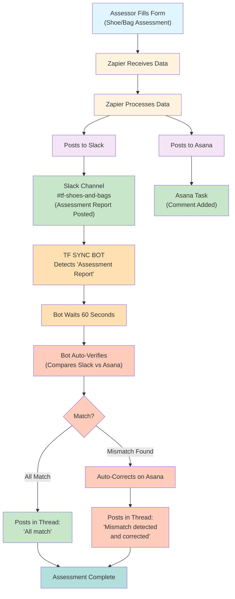
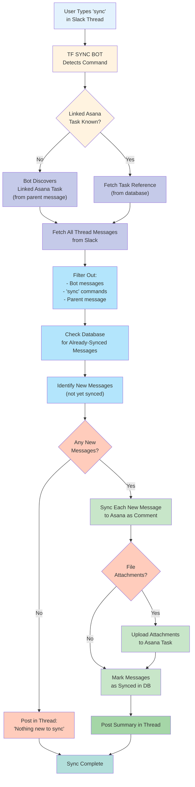
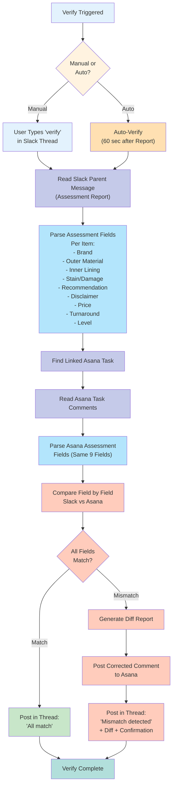

# TF Shoes & Bags Assessment — Sync & Verify SOP

---

## Table of Contents

1. [Purpose & Scope](#1-purpose--scope)
2. [What Changed](#2-what-changed)
3. [System Flow Overview](#3-system-flow-overview)
4. [Step-by-Step: Daily Workflow for Assessors](#4-step-by-step-daily-workflow-for-assessors)
5. [Step-by-Step: How to Use the "sync" Command](#5-step-by-step-how-to-use-the-sync-command)
6. [Step-by-Step: How to Use the "verify" Command](#6-step-by-step-how-to-use-the-verify-command)
7. [Auto-Verify: What to Expect](#7-auto-verify-what-to-expect)
8. [Troubleshooting & FAQ](#8-troubleshooting--faq)
9. [Glossary of Terms](#9-glossary-of-terms)

---

## 1. Purpose & Scope

### Purpose

This document explains how the new automated assessment system works for the TF Shoes & Bags team. It walks you through the daily workflow, how to use two simple commands in Slack, and what to expect from the system — so you can do your job confidently without needing to understand the technical side.

### Who This Document Is For

- Assessors who fill out item assessment forms
- Customer service staff who review and approve assessments
- Team leads who monitor the assessment pipeline

### What This Document Covers

- How a completed assessment form flows through the system automatically
- How to sync your notes, approvals, and files to Asana using a single word
- How to verify that Slack and Asana contain matching information
- How to handle common issues if something does not look right

---

## 2. What Changed

| Task | Before (Manual) | Now (Automated) |
|---|---|---|
| Posting assessment to Slack | Done manually by the assessor | Done automatically by the system |
| Adding comment to Asana task | Done manually by the assessor or team lead | Done automatically by the system |
| Checking Slack and Asana match | Done manually by spot-checking | Done automatically every 60 seconds by the bot |
| Correcting mismatched data | Done manually, often missed | Done automatically by the bot |
| Syncing approvals to Asana | Done manually by copying notes | Done with one word: `sync` |

### What Has Not Changed

- You still fill out the same assessment form as always
- You still post approvals, notes, and questions in the Slack thread
- You still review items and make recommendations the same way

**The Key Takeaway:** You do less manual admin work. The system handles the copying, checking, and correcting. Your job is to fill out the form accurately and communicate clearly in the Slack thread.

---

## 3. System Flow Overview

### Diagram 1 — End-to-End System Flow

### Diagram 2 — Sync Command Workflow

### Diagram 3 — Verify Command Workflow

---

## 4. Step-by-Step: Daily Workflow for Assessors

### Step 1 — Assess the Item

- Physically inspect the item as you normally would
- Check condition, materials, damage, and any relevant details
- Make your recommendation and determine pricing

### Step 2 — Fill Out the Assessment Form

- Open the assessment form (the same one you have always used)
- Fill in all required fields completely and accurately:
  - Brand
  - Outer Material
  - Inner Lining
  - Stain or Damage details
  - Recommendation
  - Disclaimer (if applicable)
  - Price
  - Turnaround time
  - Level
- **Double-check your entries before submitting** — accurate form data is the foundation of the whole system
- Submit the form

### Step 3 — Wait for the Automatic Post (No Action Needed)

- Within moments of submitting the form, the system will automatically:
  - Post a structured assessment report to the **#tf-shoes-and-bags** Slack channel
  - Add a comment to the matching Asana task
- You do not need to do anything at this stage

### Step 4 — Wait for Auto-Verify (No Action Needed)

- Approximately 60 seconds after the assessment is posted to Slack, the **TF SYNC BOT** will automatically check that the Slack post and the Asana task contain matching information
- If everything matches, the bot will confirm this in the Slack thread
- If there is a mismatch, the bot will automatically correct the Asana task and report what it changed

### Step 5 — Review and Respond in the Slack Thread

- Team members will review the assessment in the Slack thread
- Reply directly **in the thread** (not in the main channel) with:
  - Approvals or rejections
  - Questions or clarifications
  - Additional notes
  - Photos or files if needed

### Step 6 — Sync Thread Replies to Asana (When Needed)

- When meaningful replies have been added to the thread (such as an approval or a key note), type `sync` as a reply in the thread
- The bot will push all new replies, files, and notes to the linked Asana task

---

## 5. Step-by-Step: How to Use the "sync" Command

### What "sync" Does

The `sync` command copies your Slack thread replies — including approvals, notes, and any attached files — directly into the linked Asana task. No manual copy-pasting needed.

### What Gets Synced

- Text replies from team members
- Attached files and photos
- Approvals or rejection notes

### What Does Not Get Synced

- Bot messages (the bot's own replies are never synced)
- The original assessment post (already in Asana via the automatic flow)
- Messages that were already synced in a previous `sync` command

### How to Use "sync"

1. Open the Slack channel **#tf-shoes-and-bags**
2. Find the assessment post you want to sync
3. Click on the post to **open its thread** (the side panel)
4. In the thread reply box, type exactly: `sync`
5. Press Enter to send
6. The bot will reply with a single summary message confirming what was synced

> **Important:** You must type `sync` inside the thread, not in the main channel.

### Running "sync" More Than Once

You can use `sync` multiple times on the same thread. Each time, it only picks up messages added after the last sync.

---

### Smart Routing: How Comments Reach the Right Asana Task

When an assessment post contains **multiple items** (e.g. 3 pairs of shoes), the bot automatically routes each comment to the correct Asana task based on whether you mention a specific task name.

**The Rule:**
- **Comment includes a task name** → goes **only** to that specific Asana task
- **Comment does NOT include a task name** → goes to **all** Asana tasks in the post
- **A task that already received a specific comment is excluded from blanket comments** — this prevents conflicting messages (e.g. "Approved" going to a rejected item)

### How to Write Comments for Multi-Item Posts

| Scenario | How to Comment | Example |
|---|---|---|
| **All items — same decision** | One comment, no task name needed | `Approved. Delivery date - 8th April` |
| **One item needs a different decision** | Two comments (see below) | Rejection first, then blanket approval |
| **Each item needs a unique comment** | One comment per item, each with the task name | `[task name] - Approved for cleaning only` |

### The Most Important Pattern: Mixed Decisions

When most items are approved but one or more are rejected (or different), follow this order:

**Step 1 — Post the rejection first (with the task name):**
> `SANDALS FLIPFLOPS - private - 3/4 - Abdulrahman Altenaiji - Navy/Salmon - Rejected`

**Step 2 — Post the blanket approval (no task name):**
> `Approved as per recommendation. Delivery date - 8th April`

**Step 3 — Type `sync`**

**Result:**

| Asana Task | Comment Received |
|---|---|
| Item 1/4 | "Approved as per recommendation. Delivery date - 8th April" |
| Item 2/4 | "Approved as per recommendation. Delivery date - 8th April" |
| Item 3/4 (rejected) | "SANDALS FLIPFLOPS - private - 3/4 - ... - Rejected" **only** |

The rejected task **never** sees the "Approved" comment. The bot knows that because item 3/4 already received a specific comment, it should be excluded from the blanket approval.

> **Key Tip:** Always post specific/targeted comments **before** the blanket comment. The order matters for clean routing.

---

### Example Scenarios

**Scenario A — All Items Approved (Single Item or Multiple)**

> You reply in the thread: "Approved. Delivery date - 8th April"
>
> You type `sync`.
>
> Bot responds: *"Synced 1 new message(s) to 3 Asana task(s): ..."*
>
> All three Asana tasks receive the approval.

**Scenario B — Mixed Decision (2 Approved, 1 Rejected)**

> Comment 1: `SANDALS - private - 3/4 - Abdulrahman - Navy/Salmon - Rejected`
> Comment 2: `Approved as per recommendation. Delivery date - 8th April`
>
> You type `sync`.
>
> Bot responds: *"Synced 3 new message(s) to 3 Asana task(s): ..."*
>
> Items 1/4 and 2/4 get the approval. Item 3/4 gets only the rejection.

**Scenario C — Comment for One Specific Item**

> You reply: `HANDBAG - Chloe - 6/7 - Hani Forouzandeh - Approved for cleaning only. No color work.`
>
> You type `sync`.
>
> Bot responds: *"Synced 1 new message(s) to 1 Asana task(s): ..."*
>
> Only the 6/7 Chloe handbag task receives this comment.

**Scenario D — Syncing After Additional Notes**

> Earlier today you ran `sync` after an approval.
> An hour later, a team lead adds: "Please add a protective bag before drop-off."
>
> You type `sync` again.
>
> Only the new note is added — the earlier approval is not duplicated.

**Scenario E — Nothing New to Sync**

> You type `sync` but no new messages have been added.
>
> Bot responds: *"All synced — no new messages to push."*

---

## 6. Step-by-Step: How to Use the "verify" Command

### What "verify" Does

The `verify` command compares the assessment details in the Slack post against the Asana task comment — field by field. If they don't match, it automatically fixes the Asana task.

### What Gets Compared

- Brand
- Outer Material
- Inner Lining
- Stain or Damage
- Recommendation
- Disclaimer
- Price
- Turnaround time
- Level

### When Would You Use "verify"?

- You want to double-check that the Asana task was updated correctly
- A team lead asked you to confirm the records match
- You noticed something looked different between Slack and Asana

> Note: Auto-verify runs 60 seconds after every new post and handles most cases. You only need `verify` manually for spot-checks later.

### How to Use "verify"

1. Open the Slack channel **#tf-shoes-and-bags**
2. Find the assessment post you want to verify
3. Click on the post to **open its thread**
4. In the thread reply box, type exactly: `verify`
5. Press Enter to send
6. The bot will reply with the results

### Example Scenarios

**Scenario A — Clean Verification**

> You type `verify` in the thread.
>
> Bot responds: *"All assessment reports match between Slack and Asana."*

**Scenario B — Mismatch Detected and Auto-Corrected**

> You type `verify` in the thread.
>
> Bot responds with a report showing which fields differ (Slack value vs Asana value), then:
> *"Found 1 task(s) with issues. Correcting on Asana..."*
> *"Corrected 1 Asana task(s). The updated assessment has been posted as a new comment."*

---

## 7. Auto-Verify: What to Expect

### What Is Auto-Verify?

A background check that runs automatically — no command needed.

### When Does It Run?

Every time a new assessment report is posted to **#tf-shoes-and-bags**, the bot waits 60 seconds (for Zapier to finish posting to Asana) and then automatically verifies.

### What Does It Do?

- If everything matches: posts a brief confirmation in the thread
- If there is a mismatch: automatically corrects the Asana task and reports what it changed

### What Do You Need to Do?

Nothing. You may see a bot message appear in the thread about 60 seconds after an assessment is posted. This is normal.

---

## 8. Troubleshooting & FAQ

### "The bot did not respond after I typed sync or verify"

**Most likely cause:** You typed the command in the main channel instead of inside the thread.

**What to do:**
- Click directly on the assessment post to open the thread panel
- Type the command in the **thread reply box**, not the main channel
- Type exactly `sync` or `verify` — no extra spaces or punctuation
- Wait 10-15 seconds for the bot to respond

---

### "The bot says 'No Asana tasks found'"

**Most likely cause:** The task name in the form doesn't match the Asana task name.

**What to do:**
- Check the Asana task name for the item
- Compare it with how the name appears in the Slack post
- Even small differences (extra space, typo, abbreviation) can prevent matching
- Contact your team lead to align the naming

---

### "Verification shows a mismatch — do I need to fix it?"

**Short answer:** No. The bot fixes it automatically.

- Read the bot's message to understand which field was different
- Check your original form submission to confirm the Slack data is correct
- If the Slack post itself looks wrong, contact your team lead — a corrected form submission may be needed

---

### "The assessment was posted to Slack but I don't see an Asana comment"

**What to do:**
- Wait 2-3 minutes and refresh Asana
- If still missing, type `verify` in the Slack thread — the bot will detect the issue and push the correct data to Asana

---

### "The bot is not responding at all"

**What to do:**
- Don't keep typing commands — it won't speed things up
- Contact your system admin and let them know the bot is unresponsive
- You can still fill out forms and communicate in Slack as usual — sync and verify can be done once the bot is back online

---

### "I typed sync but yesterday's approval was not included"

**Most likely cause:** The approval was already synced in a previous `sync` run.

- Check the Asana task to confirm the approval is already there
- The bot skips messages that have already been synced to avoid duplication

---

## 9. Glossary of Terms

| Term | What It Means |
|---|---|
| **Assessment Form** | The form you fill out to record item details, condition, recommendation, and pricing |
| **Assessment Report** | The structured post that appears in Slack automatically after you submit the form |
| **Asana** | The project management tool where tasks are tracked |
| **Asana Task** | A specific item tracked inside Asana — each assessment corresponds to one task |
| **Auto-Verify** | The automatic check that runs 60 seconds after every new assessment is posted |
| **TF SYNC BOT** | The automated assistant in Slack that runs sync, verify, and auto-verify |
| **Mismatch** | When the information in Slack and Asana don't match — the bot detects and fixes this |
| **Slack Thread** | The replies attached to a specific Slack post — commands must be typed here |
| **Smart Routing** | The bot's ability to send a comment to only the correct Asana task when a task name is mentioned |
| **Blanket Comment** | A comment with no task name — goes to all tasks in the post (unless a task already received a specific comment) |
| **Targeted Comment** | A comment that includes a specific task name — goes only to that one task |
| **sync** | A command typed in a Slack thread to push replies, notes, and files to Asana |
| **verify** | A command typed in a Slack thread to check Slack and Asana match |
| **Zapier** | The behind-the-scenes tool that moves data from the form to Slack and Asana automatically |

---

*Document Owner: TF Operations Team*
*Last Updated: April 2026*
*For system issues, contact your admin. For process questions, contact your team lead.*
